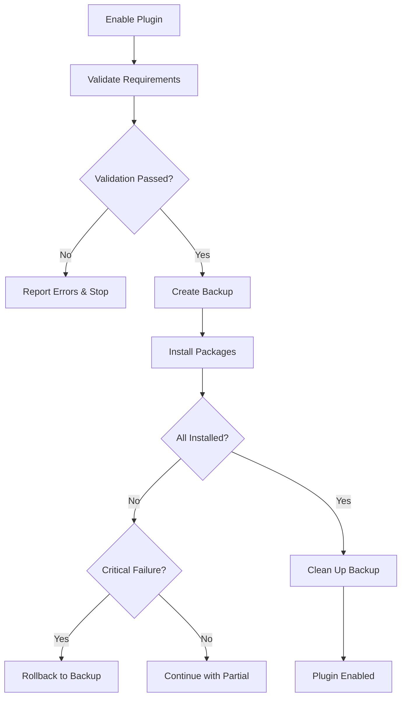

# Plugin Requirements System Documentation

## 🛡️ Hardened Per-Plugin Requirements System

The NetWORKS plugin system uses a **per-plugin requirements** approach where each plugin manages its own dependencies in isolated directories. This system has been hardened with comprehensive validation, security checks, and error handling.

## 📋 Table of Contents

1. [System Overview](#system-overview)
2. [Security Features](#security-features)
3. [Requirements Format](#requirements-format)
4. [Installation Process](#installation-process)
5. [Error Handling & Rollback](#error-handling--rollback)
6. [Developer Guide](#developer-guide)
7. [Troubleshooting](#troubleshooting)
8. [API Reference](#api-reference)

---

## 🏗️ System Overview

### Architecture
```
plugins/
├── plugin_name/
│   ├── lib/                    # ← Isolated dependencies (auto-managed)
│   │   ├── package1/
│   │   ├── package2/
│   │   └── ...
│   ├── manifest.json          # ← Requirements definition
│   ├── plugin_name.py         # ← Entry point
│   └── ...
```

### Key Benefits
- ✅ **Zero Version Conflicts** - Complete isolation between plugins
- ✅ **Security Validated** - Package name validation and typosquatting protection
- ✅ **Automatic Rollback** - Failed installations are automatically reverted
- ✅ **Progress Tracking** - Real-time installation progress and status
- ✅ **Dependency Validation** - Pre-installation validation and conflict detection

---

## 🔒 Security Features

### 1. Package Name Validation
The system validates all package names before installation:

```python
# Automatically detects and blocks:
suspicious_patterns = [
    r'.*-?backdoor.*',    # Backdoor packages
    r'.*-?malware.*',     # Malware packages  
    r'.*-?virus.*',       # Virus packages
    r'.*[0-9]{6,}.*',     # Packages with many digits (spam pattern)
]
```

### 2. Typosquatting Protection
Detects packages that are similar to popular packages:
```python
# Warns about packages like:
'requessts' vs 'requests'  # One character different
'nump' vs 'numpy'          # Shortened names
```

### 3. Format Validation
Ensures package names follow Python conventions:
```python
valid_pattern = r'^[a-zA-Z0-9._-]+$'  # Only safe characters
```

### 4. Size and Space Checking
- Estimates installation size before downloading
- Validates available disk space
- Prevents installations that would fill the disk

---

## 📄 Requirements Format

### manifest.json Structure
```json
{
    "id": "plugin_name",
    "name": "Plugin Display Name",
    "version": "1.0.0",
    "entry_point": "plugin_name.py",
    "requirements": {
        "python": [
            "requests>=2.25.1",
            "pycryptodome>=3.0",
            "custom-package==1.2.3"
        ],
        "system": [
            "Python 3.8+",
            "Qt 6.5+",
            "Nmap 7.0+"
        ]
    }
}
```

### Python Requirements Formats
```json
"python": [
    "package",              // Latest version
    "package>=1.0",         // Minimum version
    "package==1.2.3",       // Exact version
    "package>=1.0,<2.0",    // Version range
    "git+https://...",      // Git repository
    "package[extra]>=1.0"   // With extras
]
```

### System Requirements Format
```json
"system": [
    "Python 3.8+",         // Minimum Python version
    "Qt 6.5+",             // Minimum Qt version  
    "Nmap 7.0+",           // External tool requirement
    "Windows 10+",         // OS requirement
    "RAM 4GB+"             // Hardware requirement
]
```

---

## ⚙️ Installation Process

### 1. Pre-Installation Validation
```python
# Automatic checks performed:
✓ Package name security validation
✓ Version conflict detection with other plugins  
✓ Disk space requirements estimation
✓ System requirements format validation
✓ Plugin directory and entry point validation
```

### 2. Installation Flow


### 3. Progress Tracking
Real-time progress signals are emitted during installation:
```python
# UI can connect to these signals:
requirements_progress.emit(plugin_id, progress_percent, status_message)

# Example emissions:
(plugin_id, 25, "Installing requests...")
(plugin_id, 75, "Installing pycryptodome...")
(plugin_id, 100, "All requirements installed")
```

---

## 🚨 Error Handling & Rollback

### Automatic Rollback Triggers
- **Critical Failure**: >50% of packages fail to install
- **Timeout**: Any package takes >5 minutes to install
- **Exception**: Unexpected errors during installation
- **Manual**: User cancellation during installation

### Rollback Process
```python
# Automatic backup creation before installation
backup_dir = f"{lib_dir}_backup_{timestamp}"
shutil.copytree(lib_dir, backup_dir)

# On failure:
shutil.rmtree(lib_dir)           # Remove failed installation
shutil.move(backup_dir, lib_dir)  # Restore backup
```

### Error Types and Handling

| Error Type | Action | User Impact |
|------------|--------|-------------|
| **Package Not Found** | Log error, continue | Plugin may have reduced functionality |
| **Version Conflict** | Warn user, continue | Potential compatibility issues |
| **Network Timeout** | Retry once, then fail | Installation may take longer |
| **Disk Space** | Stop installation | User must free space |
| **Security Violation** | Block package | Potential security threat prevented |
| **Critical Failure** | Full rollback | Plugin remains in previous state |

---

## 👨‍💻 Developer Guide

### Creating a Plugin with Requirements

1. **Create Plugin Directory**
```bash
plugins/my_plugin/
├── manifest.json
├── my_plugin.py
├── core/
├── ui/
└── utils/
```

2. **Define Requirements in manifest.json**
```json
{
    "id": "my_plugin",
    "name": "My Plugin",
    "version": "1.0.0",
    "entry_point": "my_plugin.py",
    "requirements": {
        "python": [
            "requests>=2.25.1",
            "beautifulsoup4>=4.9.0"
        ],
        "system": [
            "Python 3.8+",
            "Internet Connection"
        ]
    }
}
```

3. **Use Requirements in Plugin Code**
```python
# my_plugin.py
import sys
import os

# Add plugin lib to path
plugin_dir = os.path.dirname(__file__)
lib_dir = os.path.join(plugin_dir, 'lib')
if lib_dir not in sys.path:
    sys.path.insert(0, lib_dir)

# Now you can import requirements
import requests
from bs4 import BeautifulSoup

class MyPlugin:
    def initialize(self, app, plugin_info):
        # Plugin initialization
        pass
```

### Best Practices

#### 1. Version Specification
```json
// ✅ Good: Specify minimum versions
"requests>=2.25.1"

// ❌ Avoid: Exact versions (breaks compatibility)
"requests==2.25.1"

// ✅ Good: Range for stability
"requests>=2.25.1,<3.0"
```

#### 2. Minimal Dependencies
```json
// ✅ Good: Only include what you need
"python": ["requests>=2.25.1"]

// ❌ Avoid: Kitchen sink approach
"python": ["requests", "urllib3", "certifi", "charset-normalizer"]
```

#### 3. Safe Package Names
```json
// ✅ Good: Well-known packages
"requests", "beautifulsoup4", "lxml"

// ⚠️ Be careful: Less common packages
"obscure-package", "new-lib-2023"
```

### Testing Plugin Requirements

```python
# tests/test_my_plugin_requirements.py
import unittest
import sys
import os

class TestPluginRequirements(unittest.TestCase):
    def setUp(self):
        # Add plugin lib to path
        plugin_dir = os.path.join(os.path.dirname(__file__), '..', 'plugins', 'my_plugin')
        lib_dir = os.path.join(plugin_dir, 'lib')
        if lib_dir not in sys.path:
            sys.path.insert(0, lib_dir)
    
    def test_required_imports(self):
        """Test that all required packages can be imported"""
        try:
            import requests
            import beautifulsoup4
        except ImportError as e:
            self.fail(f"Required package not available: {e}")
    
    def test_package_versions(self):
        """Test that package versions meet requirements"""
        import requests
        from packaging import version
        
        self.assertGreaterEqual(
            version.parse(requests.__version__),
            version.parse("2.25.1")
        )
```

---

## 🔧 Troubleshooting

### Common Issues

#### 1. Installation Timeout
```
Error: Installation of package timed out after 5 minutes
```
**Solutions:**
- Check internet connection
- Try installing package manually: `pip install package_name`
- Use a faster package index: Add `--index-url` in requirements

#### 2. Version Conflicts
```
Warning: Potential version conflict: requests: plugin_a wants 'requests>=2.25', plugin_b has 'requests>=2.30'
```
**Solutions:**
- Update both plugins to compatible versions
- Use version ranges instead of exact versions
- Contact plugin developers for compatibility

#### 3. Package Not Found
```
Error: Failed to install requirement: No matching distribution found for package-name
```
**Solutions:**
- Check package name spelling
- Verify package exists on PyPI
- Check if package requires specific Python version

#### 4. Permission Errors
```
Error: Permission denied when installing requirements
```
**Solutions:**
- Run NetWORKS as administrator (Windows)
- Check folder permissions
- Ensure antivirus isn't blocking installation

#### 5. Disk Space Issues
```
Error: Insufficient disk space. Required: 50MB, Available: 20MB
```
**Solutions:**
- Free up disk space
- Move plugins to drive with more space
- Clean up old plugin backups

### Debug Mode

Enable debug logging for detailed installation information:
```python
# In your plugin or main application
import logging
logging.getLogger('src.core.plugin_manager').setLevel(logging.DEBUG)
```

Debug logs include:
- Package validation steps
- Installation commands executed
- Backup creation/restoration
- Detailed error messages

### Manual Recovery

If automatic rollback fails:
```bash
# Navigate to plugin directory
cd plugins/plugin_name/

# Remove corrupted lib directory
rm -rf lib/

# Restore from backup (if exists)
mv lib_backup_* lib/

# Or reinstall manually
mkdir lib
pip install --target lib package_name
```

---

## 📚 API Reference

### PluginManager Methods

#### `enable_plugin(plugin_id: str) -> bool`
Enable a plugin with full validation and requirements installation.

**Parameters:**
- `plugin_id`: Unique identifier of the plugin

**Returns:**
- `bool`: True if successfully enabled

**Example:**
```python
success = plugin_manager.enable_plugin("my_plugin")
if success:
    print("Plugin enabled successfully")
```

#### `_validate_plugin_requirements(plugin_info) -> tuple`
Validate plugin requirements before installation.

**Returns:**
- `tuple`: (is_valid: bool, errors: List[str], warnings: List[str])

#### `_install_plugin_requirements(plugin_info) -> bool`
Install plugin requirements with rollback capability.

**Returns:**
- `bool`: True if installation successful

### Signals

#### `requirements_progress(plugin_id: str, progress: int, message: str)`
Emitted during requirements installation progress.

**Example:**
```python
def on_progress(plugin_id, progress, message):
    print(f"{plugin_id}: {progress}% - {message}")

plugin_manager.requirements_progress.connect(on_progress)
```

#### `plugin_error(plugin_info, error_message: str)`
Emitted when plugin encounters an error.

#### `plugin_enabled(plugin_info)`
Emitted when plugin is successfully enabled.

### Configuration

#### Environment Variables
```bash
# Set custom timeout for package installation (seconds)
PLUGIN_INSTALL_TIMEOUT=600

# Set custom package index URL
PIP_INDEX_URL=https://pypi.org/simple/

# Enable verbose pip output
PIP_VERBOSE=1
```

#### Registry Settings
```json
{
    "plugin_system": {
        "max_install_time": 300,
        "backup_retention_days": 7,
        "security_checks": true,
        "auto_rollback": true
    }
}
```

---

## 📝 Changelog

### Version 2.0 (Current)
- ✅ Added comprehensive security validation
- ✅ Implemented automatic rollback system
- ✅ Added progress tracking and status signals
- ✅ Enhanced error handling and recovery
- ✅ Added conflict detection and warnings

### Version 1.0 (Previous)
- ✅ Basic per-plugin requirements installation
- ✅ Simple manifest.json format
- ✅ Basic error logging

---

## 📞 Support

For issues with the plugin requirements system:

1. **Check Logs**: Look in `logs/` directory for detailed error messages
2. **Enable Debug**: Set logging level to DEBUG for detailed information
3. **Manual Recovery**: Use manual recovery steps if automatic rollback fails
4. **Report Issues**: Include full error logs and plugin manifest when reporting

---

*This documentation covers the hardened plugin requirements system as of NetWORKS v0.9.12* 